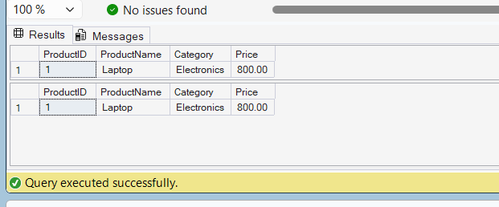

# Exercise 1 - Non Clustered Index

## Objective
Create a Non-Clustered Index on the ProductName column and compare query execution before and after index creation.

## SQL Concepts Used
- CREATE NONCLUSTERED INDEX
- SELECT
- WHERE

## Files
- Exercise1_NonClusteredIndex.sql
- Exercise1_Output.png

## Output



## Query

```sql
SELECT *
FROM Products
WHERE ProductName = 'Laptop';

CREATE NONCLUSTERED INDEX IX_Products_ProductName
ON Products(ProductName);

SELECT *
FROM Products
WHERE ProductName = 'Laptop';
```