# Git HandsOn 1 - Git Configuration

## Objective

This hands-on demonstrates the basic Git workflow, including:

- Installing and configuring Git
- Configuring Git username and email
- Installing and configuring Notepad++
- Initializing a Git repository
- Creating and tracking files
- Committing changes
- Connecting a local repository with GitHub
- Pushing the repository to GitHub

---

# Prerequisites

- Git for Windows
- Git Bash
- GitHub Account
- Notepad++

---

# Environment

| Software | Version |
|----------|----------|
| Git | Latest Installed |
| Git Bash | Installed |
| Notepad++ | v8.9.7 |
| Operating System | Windows 11 |

---

# Repository Structure

```text
HandsOn-1-Git-Configuration
│
├── README.md
└── Screenshots
```

---

# Step 1 - Verify Git Installation

Command

```bash
git --version
```

Output

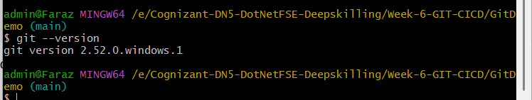

---

# Step 2 - Configure Git Username

Commands

```bash
git config --global user.name "Md Sarfaraz Alam"

git config --global user.name
```

Output

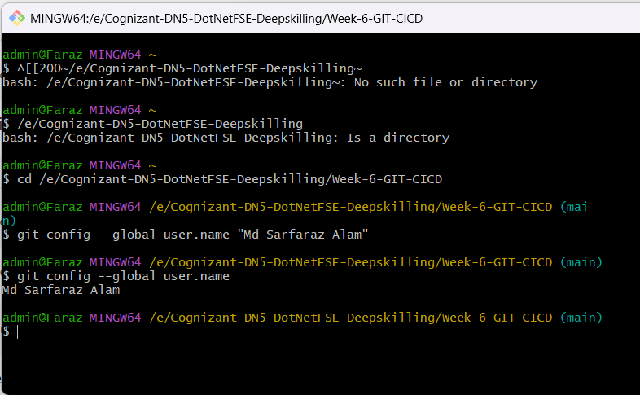

---

# Step 3 - Configure Git Email

Commands

```bash
git config --global user.email "mdsarfarazalam669@gmail.com"

git config --global user.email
```

Output

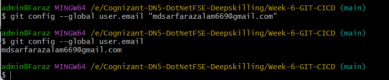

---

# Step 4 - Verify Global Git Configuration

Command

```bash
git config --global --list
```

Output

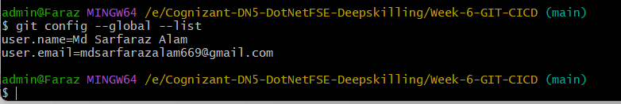

---

# Step 5 - Install Notepad++

Installed Notepad++ successfully.

Output

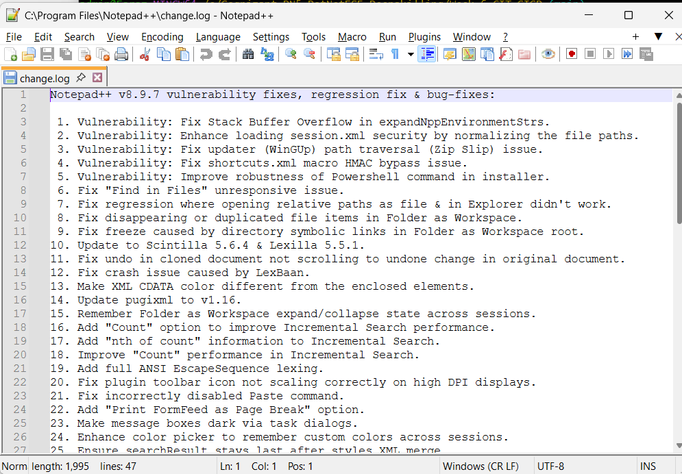

---

# Step 6 - Configure Notepad++ as Git Editor

Commands

```bash
git config --global core.editor "'/c/Program Files/Notepad++/notepad++.exe' -multiInst -nosession"
```

```bash
git config --global core.editor
```

Output

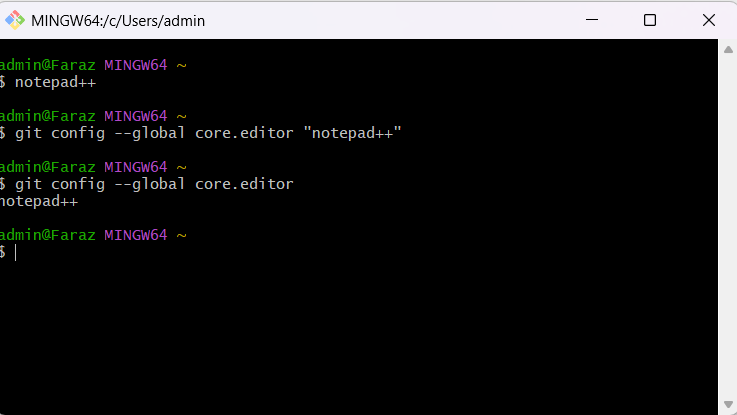

---

# Step 7 - Open Global Git Configuration

Command

```bash
git config --global -e
```

Output

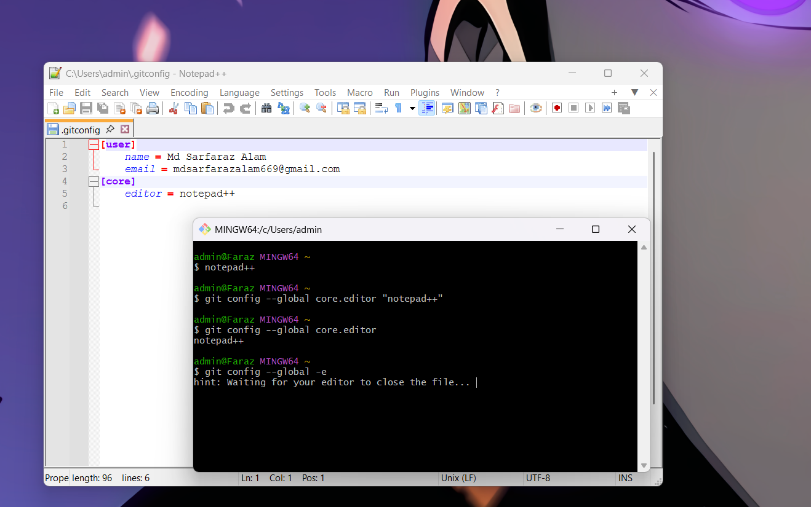

---

# Step 8 - Navigate to GitDemo

Command

```bash
cd /e/Cognizant-DN5-DotNetFSE-Deepskilling/Week-6-GIT-CICD/GitDemo

pwd
```

Output

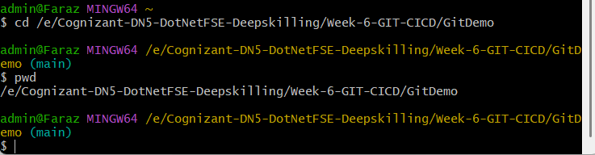

---

# Step 9 - Initialize Git Repository

Command

```bash
git init
```

Output

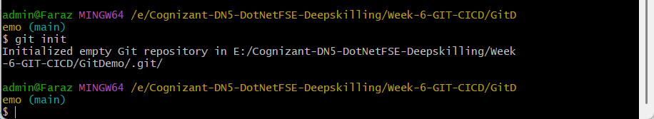

---

# Step 10 - Verify Hidden Files

Command

```bash
ls -la
```

Output

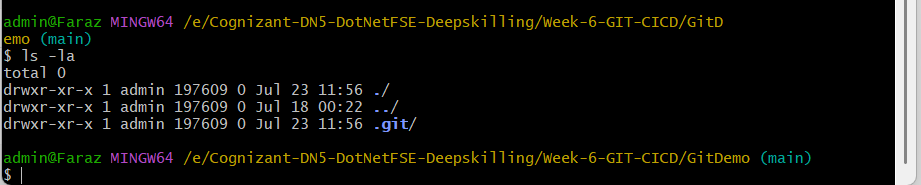

---

# Step 11 - Create welcome.txt

Commands

```bash
echo Welcome to Git HandsOn 1 > welcome.txt

ls
```

Output

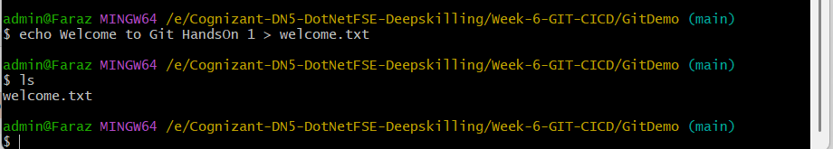

---

# Step 12 - Verify File Content

Command

```bash
cat welcome.txt
```

Output

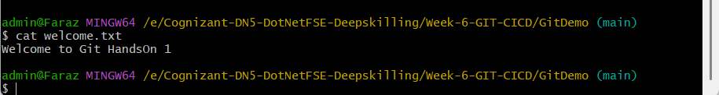

---

# Step 13 - Git Status Before Adding File

Command

```bash
git status
```

Output

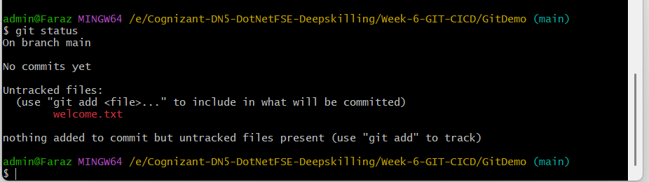

---

# Step 14 - Add File to Staging Area

Commands

```bash
git add welcome.txt

git status
```

Output

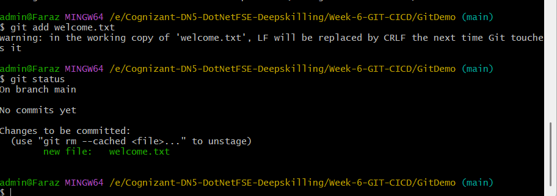

---

# Step 15 - Commit Changes

Command

```bash
git commit -m "Add welcome.txt"
```

Output

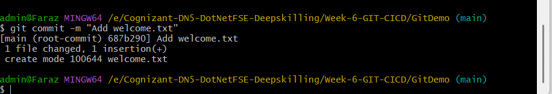

---

# Step 16 - Push Repository to GitHub

Commands

```bash
git remote add origin https://github.com/Sarfarazsfz/GitDemo.git

git branch -M main

git push -u origin main
```

Output

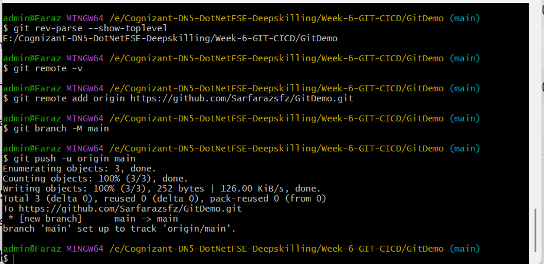

---

# Step 17 - Verify Repository on GitHub

Output

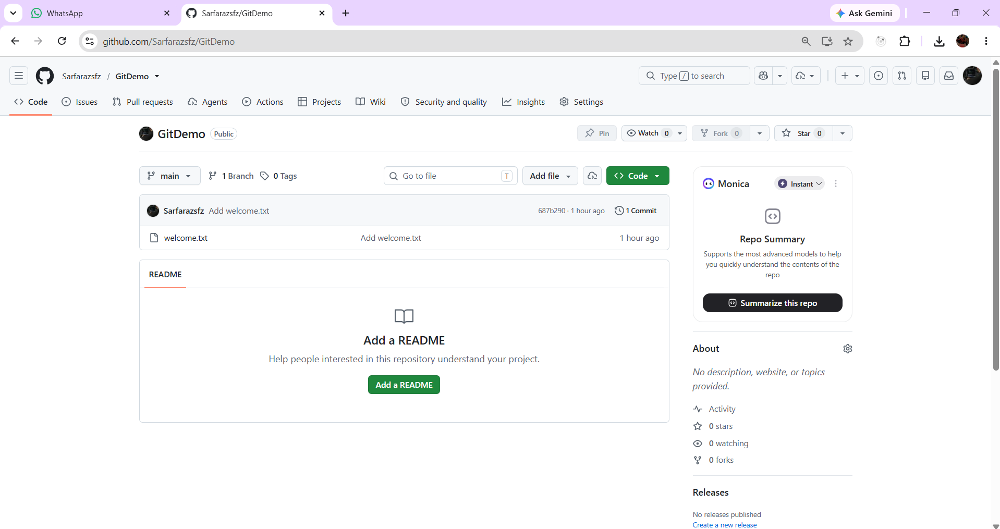

---

# Git Commands Used

```bash
git --version
git config --global user.name
git config --global user.email
git config --global --list
git init
git status
git add
git commit
git remote add origin
git branch -M main
git push -u origin main
```

---

# Learning Outcome

After completing this hands-on, the following Git concepts were learned:

- Git installation
- Git configuration
- Git repository initialization
- Working directory
- Staging area
- Local repository
- Git commit
- GitHub remote repository
- Git push
- Git workflow

---

# Author

**Md Sarfaraz Alam**

B.Tech Computer Science and Engineering

VFSTR University

Cognizant Digital Nurture 5.0