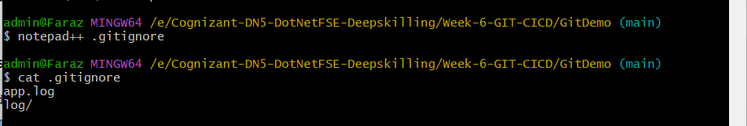
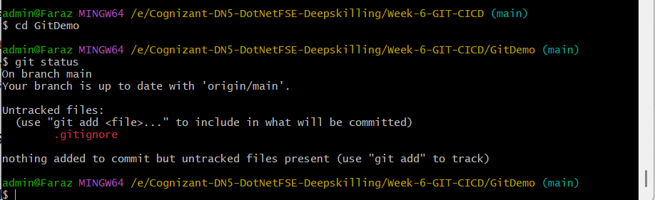
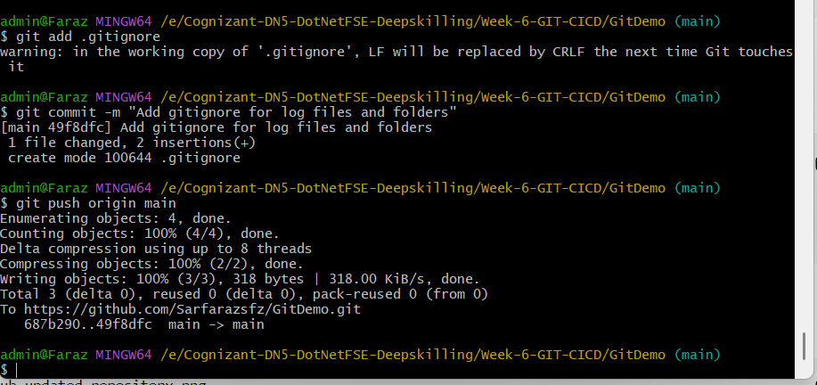

# HandsOn 2 - Git Ignore

## Objective

To understand how Git Ignore works by ignoring unwanted files and folders from the Git repository.

## Prerequisites

- Git installed
- Notepad++ configured as the default editor
- Local Git repository (GitDemo)
- GitHub remote repository

## Tasks Performed

1. Created a `.log` file (`app.log`).
2. Created a `log` folder.
3. Updated the `.gitignore` file to ignore:
   - `*.log`
   - `log/`
4. Verified using `git status` that the `.log` file and `log` folder were ignored.
5. Committed the `.gitignore` file.
6. Pushed the changes to GitHub.

## .gitignore Content

```text
*.log
log/
```

## Screenshots

### 1. Git Ignore Content



---

### 2. Git Status Verification



---

### 3. Git Commit


---

### 4. Git Push



---

## Result

Successfully implemented Git Ignore to exclude `.log` files and the `log` folder from version control.