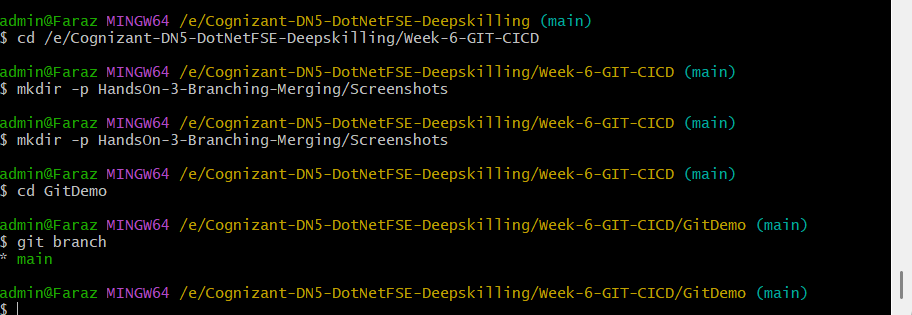
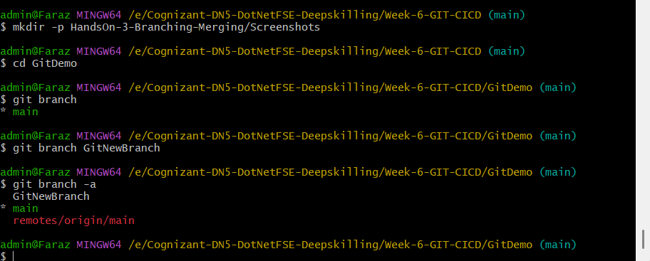
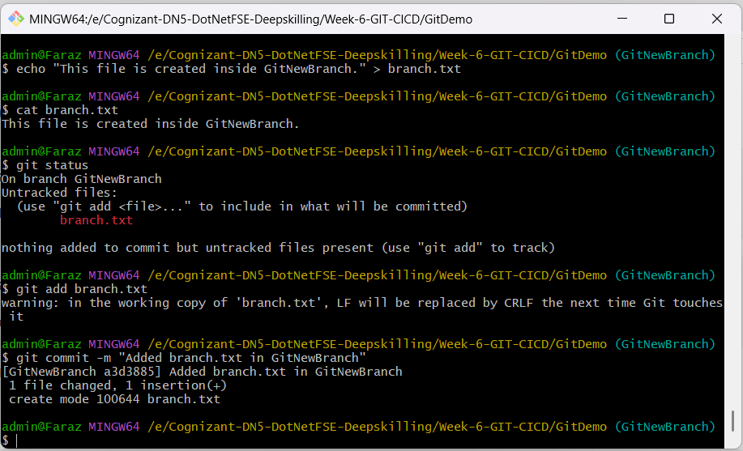
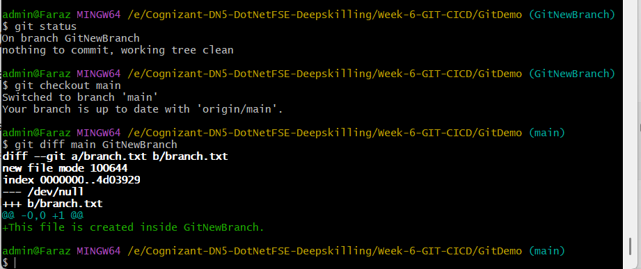
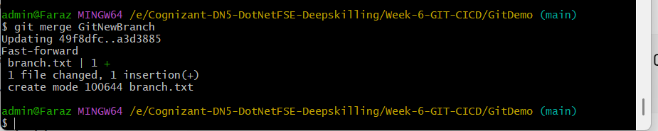
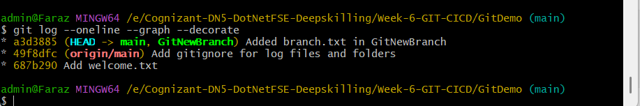
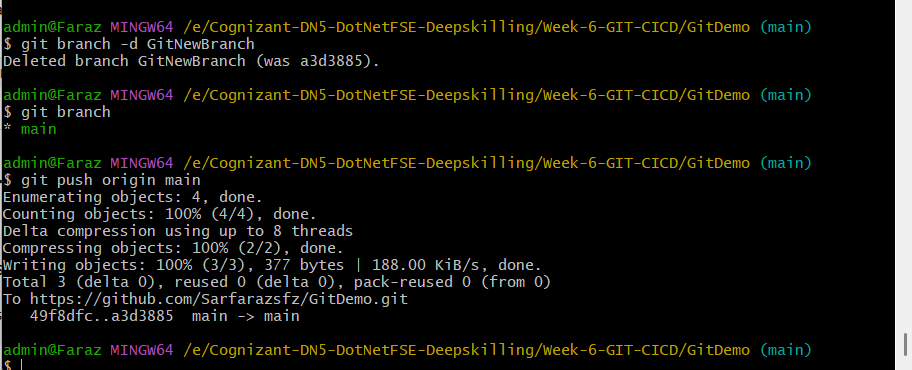

# HandsOn 3 - Git Branching and Merging

## Objective

To understand Git Branching and Merging by creating a new branch, making changes in the branch, comparing it with the main branch, merging the changes, and deleting the branch after a successful merge.

---

## Prerequisites

- Git installed and configured
- Local Git repository (GitDemo)
- GitHub remote repository
- Git Bash

---

## Tasks Performed

1. Created a new branch named `GitNewBranch`.
2. Listed all available local and remote branches.
3. Switched to the newly created branch.
4. Created a new file named `branch.txt`.
5. Added content to the file.
6. Added the file to the staging area.
7. Committed the changes.
8. Verified the repository status using `git status`.
9. Switched back to the `main` branch.
10. Compared the differences between `main` and `GitNewBranch`.
11. Merged `GitNewBranch` into the `main` branch.
12. Displayed the commit history using `git log --oneline --graph --decorate`.
13. Deleted the merged branch.
14. Pushed the updated repository to GitHub.

---

## Commands Used

```bash
git branch GitNewBranch
git branch -a
git checkout GitNewBranch

echo "This file is created inside GitNewBranch." > branch.txt

git add branch.txt
git commit -m "Added branch.txt in GitNewBranch"

git status

git checkout main

git diff main GitNewBranch

git merge GitNewBranch

git log --oneline --graph --decorate

git branch -d GitNewBranch

git push origin main
```

---

## Screenshots

### 1. Current Branch



---

### 2. Branch List



---

### 3. Branch Commit



---

### 4. Branch Difference



---

### 5. Merge Successful



---

### 6. Git Log



---

### 7. Push Successful



---

## Result

Successfully performed Git Branching and Merging by creating a new branch, committing changes, comparing branches, merging the branch into the main branch, viewing the commit history, deleting the merged branch, and pushing the updated repository to GitHub.