# HandsOn 4 - Git Merge Conflict Resolution

## Objective

To understand how to resolve merge conflicts in Git by creating a branch, making conflicting changes in the branch and main branch, merging them, resolving the conflict using P4Merge, and finalizing the merge.

## Prerequisites

- Git installed and configured
- Git Bash
- GitDemo repository
- P4Merge installed

## Tasks Performed

1. Verified the repository was in a clean state.
2. Created a new branch named `GitWork`.
3. Created `hello.xml` in the branch and committed it.
4. Updated `hello.xml` again in the branch and committed the changes.
5. Switched back to `main`.
6. Created a different `hello.xml` in `main` and committed it.
7. Compared the differences between `main` and `GitWork`.
8. Merged `GitWork` into `main`.
9. Resolved the merge conflict using P4Merge.
10. Added the merge backup file to `.gitignore`.
11. Deleted the merged branch.
12. Verified the final commit history.
13. Pushed the updated repository to GitHub.

## Commands Used

```bash
git status
git checkout -b GitWork
echo "<hello>branch version 1</hello>" > hello.xml
git add hello.xml
git commit -m "Add hello.xml in GitWork"

echo "<hello>branch version 2</hello>" > hello.xml
git add hello.xml
git commit -m "Update hello.xml in GitWork"

git checkout main
echo "<hello>main version</hello>" > hello.xml
git add hello.xml
git commit -m "Add hello.xml in main"

git log --oneline --graph --decorate --all
git diff main GitWork

git merge GitWork
git mergetool

git add hello.xml
git commit -m "Resolve merge conflict using P4Merge"

echo "*.orig" >> .gitignore
git add .gitignore
git commit -m "Ignore merge backup files"

git branch
git branch -d GitWork
git log --oneline --graph --decorate
git push origin main
```

## Screenshots

### 1. Clean Status
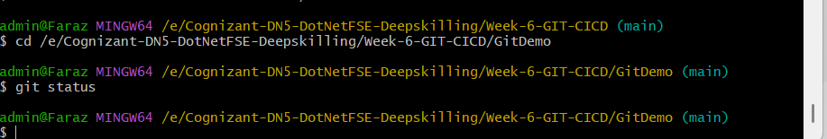

### 2. Branch Created and Branch List
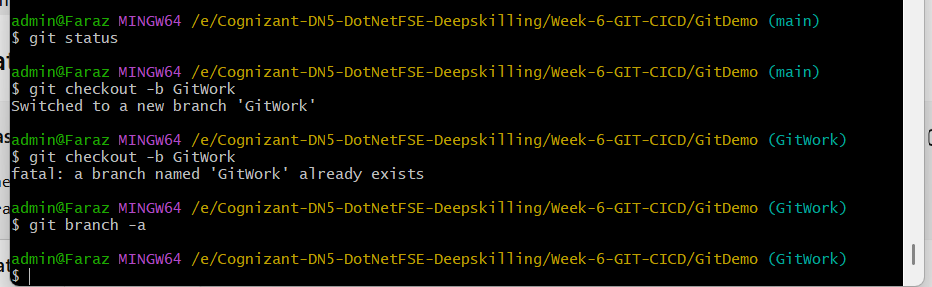

### 3. First Branch Commit
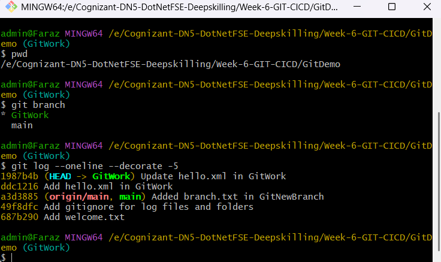

### 4. Second Branch Commit


### 5. Main Branch Status
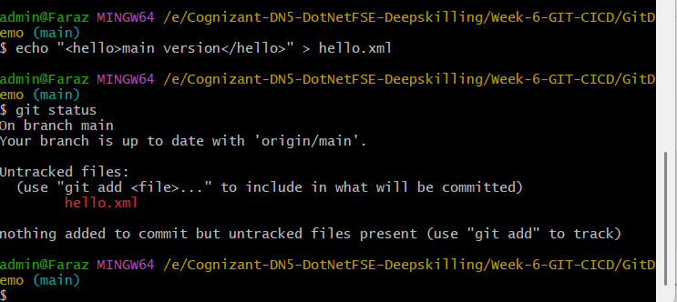

### 6. Main Branch Commit
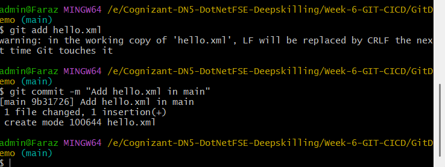

### 7. Commit Graph
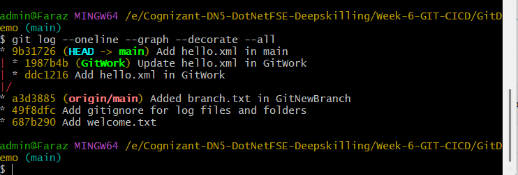

### 8. Diff Between Branches
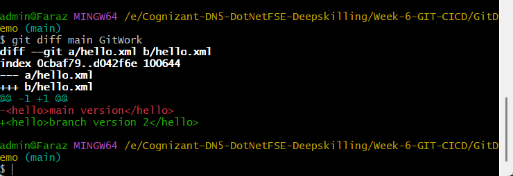

### 9. P4Merge Window
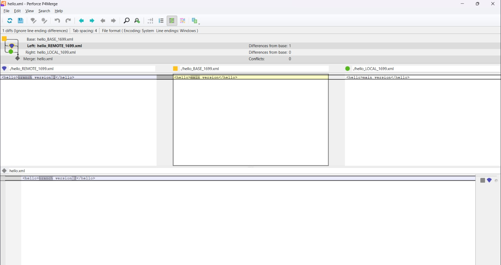

### 10. Merge Conflict
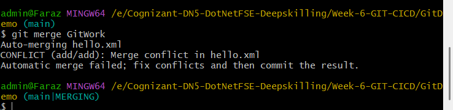

### 11. Status After Conflict
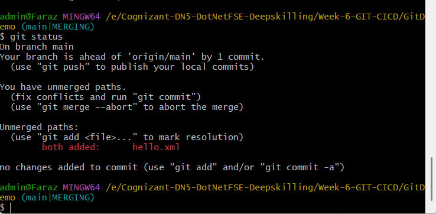

### 12. Backup File Added to Ignore
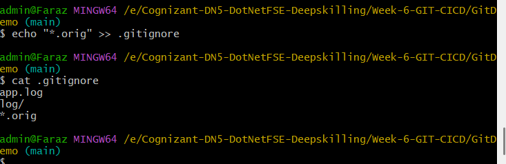

### 13. Working Tree Clean
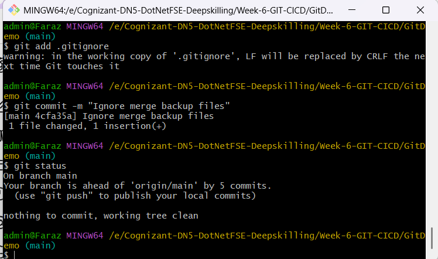

### 14. Branch List
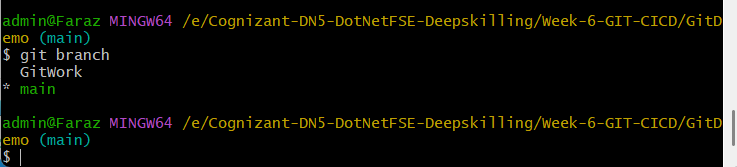

### 15. Branch Deleted
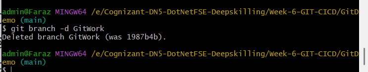

### 16. Branch List After Delete
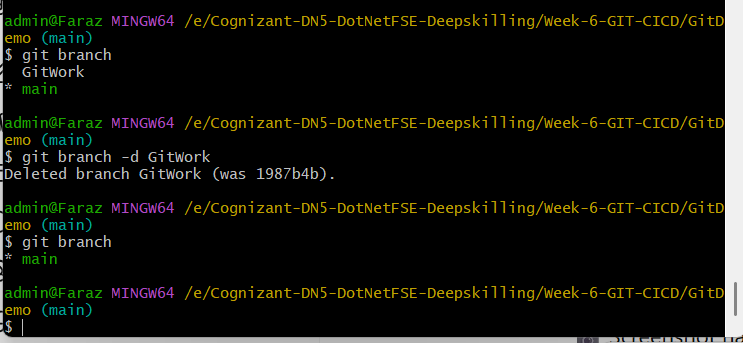

### 17. Final Git Log
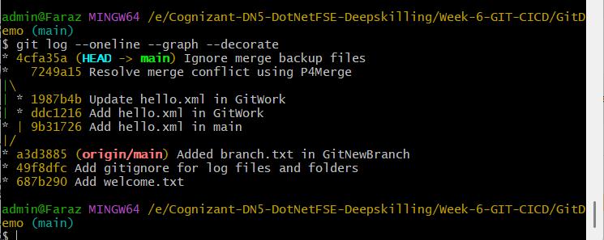

### 18. Push Success


## Result

The merge conflict was successfully resolved using P4Merge, the backup file was ignored using `.gitignore`, the merged branch was deleted, and the updated repository was pushed to GitHub.