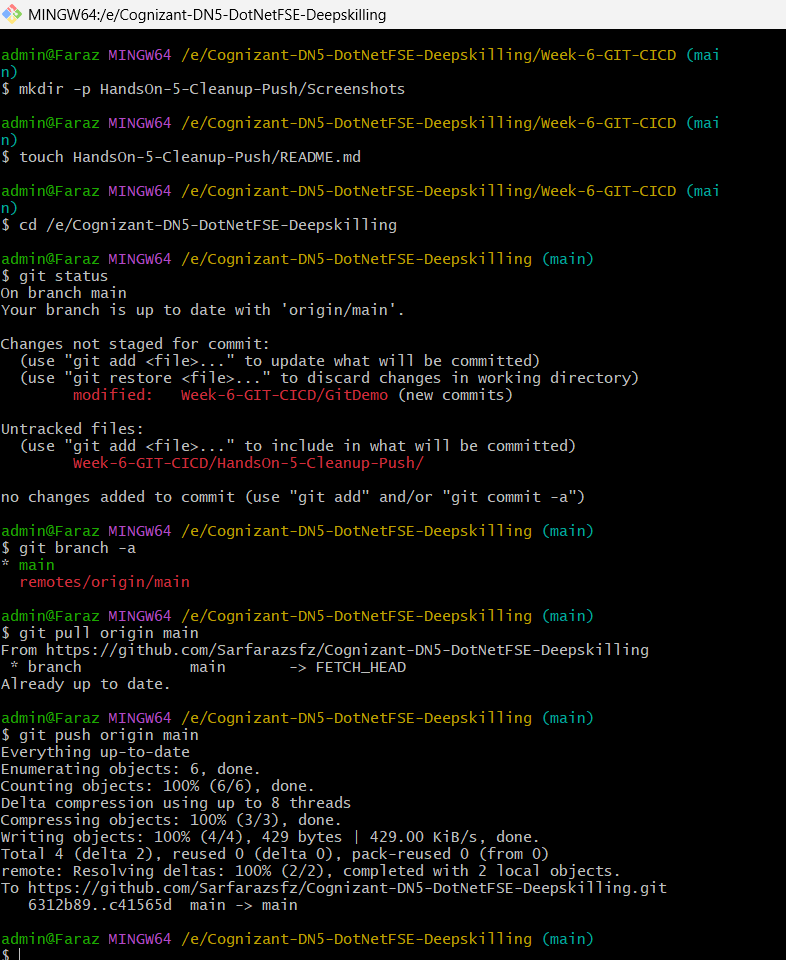

# HandsOn 5 - Cleanup and Push Back to Remote Git

## Objective

To verify the repository status, synchronize the local repository with the remote repository, and push the latest changes to GitHub.

---

## Prerequisites

- Git installed and configured
- GitHub account
- Git Bash
- Existing local Git repository

---

## Tasks Performed

1. Verified that the repository was on the `main` branch.
2. Checked the repository status using `git status`.
3. Listed all available local and remote branches.
4. Pulled the latest changes from the remote GitHub repository.
5. Verified that the local repository was already up to date.
6. Pushed the latest local changes to the remote repository.
7. Verified that the push operation completed successfully.

---

## Commands Used

```bash
git status
git branch -a
git pull origin main
git push origin main
```

---

## Screenshot

### Cleanup and Push to Remote Repository



---

## Result

Successfully verified the repository status, synchronized the local repository with the remote GitHub repository using `git pull`, and pushed the latest changes to the remote repository using `git push`. The repository is now successfully updated on GitHub.